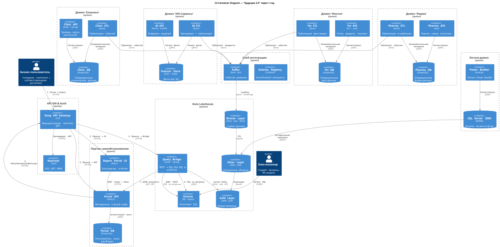

# Задание 1. 

## Спроектируйте архитектуру системы через год.

На диаграмме для экономии места я не стал указывать потребителей AI API, FinAPI и PharmaAPI. Подразумевается, что есть приложения, их использующие

Ссылка на файл [plantuml](./c4.puml)

Оно же картинкой:

# Опишите проблемные места.

| № | Проблема                                                                                            | Что это значит для ИТ                                  | Приоритет |
|---|-----------------------------------------------------------------------------------------------------|--------------------------------------------------------|-----------|
| 1 | "Сложный отчёт ждём часами" -> теряем деньги и клиентов                                             | DWH 2008 + сотни трансформаций = низкая скорость       | Must      |
| 2 | Новый бизнес (фарма, электроника) это каждый раз новые таблицы в DWH и несколько месяцев разработки | Легаси-схема не масштабируется, нужно переписывать код | Must      |
| 3 | Нет единого языка: "клиент" в клинике это не "клиент" в банке                                       | Разные модели, дубли, ошибки в сводной отчётности      | Should    |
| 4 | Нельзя открыть доступ аналитику к чувствительным мед-данным                                         | Риск штрафа по 152-ФЗ / GDPR -> аналитика страдает     | Should    |
| 5 | Power Builder 1998 года, сложно найти квалифицированные кадры                                       | Кадровый риск, дорогое сопровождение                   | Could     |
| 6 | BI-консистентность: каждый департамент тянет "свою" цифру                                           | Нет единого источника правды                           | Should    |
| 7 | Резервное копирование 400 ТБ занимает более 24 часов                                                | Возможен большой RPO при аварии                        | Could     |

## Приоритизируйте выявленные проблемы

### Метод Эйзенхауэра

Важно / Срочно
- Пункты 1 и 2: производительность + скорость подключения новых бизнесов.  
  Решение: внедрение Lakehouse, отказ от монолитного DWH, доменные ETL-потоки.

Важно / Не срочно
- Пункты 3, 4, 6: единое информационное пространство, Data Governance, ролевое ACL.  
  Решение: Data Catalog + маскирование ПД.

Не важно / Срочно
- Пункт 5: Power Builder. Пока работает - оставляем, но планируем в будущем миграцию на веб.

Не важно / Не срочно
- Пункт 7: улучшение SLA бэкапа. Решается инфраструктурным увеличением полосы/инкрементальными снэпшотами Delta Lake.
