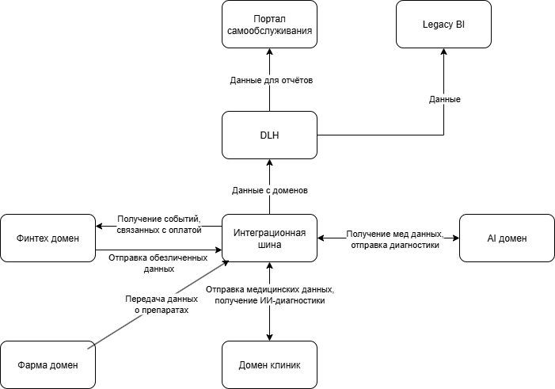

# Задание 2.

## Разделение системы на домены

Логика разделения на домены

| Домен                   | Граница                                            | Публичные события (примеры)                    |
|-------------------------|----------------------------------------------------|------------------------------------------------|
| Клиники                 | Управление приёмами, картами, врачами, расписанием | PatientRegistered, VisitClosed, LabResultReady |
| Финтех                  | Счета, кредиты, платежи, комиссии                  | AccountOpened, PaymentCompleted, LoanApproved  |
| ИИ-Сервисы              | ML-диагностика, feature-engineering, предикты      | DiagnosisPredicted, RiskScoreCalculated        |
| Фарма                   | Партии препаратов, поставки, серии                 | BatchProduced, ShipmentDelivered               |
| Data Lakehouse          | Хранилище и вычисления                             | ---                                            |
| Портал самообслуживания | Self-service BI, права, дашборды                   | ---                                            |

## Потоки данных между доменами

Примеры потоков данных между доменами:

1. Клиники -> Kafka -> Lakehouse  
   `VisitClosed` содержит `patient_id, diagnosis_code, doctor_id, visit_cost`.  
   Финтех подписывается на топик и делает автоматическое списание `visit_cost` со счёта пациента.

2. Финтех -> Kafka -> Lakehouse  
   `PaymentCompleted` содержит `account_id, amount, status`.  
   Портал строит сводку "выручка по клиникам за день".

3. ИИ ->Kafka -> Lakehouse
   `DiagnosisPredicted` содержит `patient_id, icd_code, confidence`.  
   Клиники читают топик и показывают врачу "AI-диагностику" в UI.

4. Фарма -> Kafka -> Lakehouse  
   `BatchProduced` содержит `medicament_id, qty, expiry_date`.  
   ИИ-сервисы используют поле `qty` как фичу для прогноза спроса.

 Ссылка на файл [drawio](./dfd.drawio)

Оно же картинкой:

## Преимущества для компании

| Преимущество                                                                                                                               | Механизм реализации                                                                                                      | Бизнес-результат                                                                 |
|:-------------------------------------------------------------------------------------------------------------------------------------------|:-------------------------------------------------------------------------------------------------------------------------|:---------------------------------------------------------------------------------|
| **Автономность релизов** Домены развертываются независимо, без зависимости от общего графика деплоя.                                    | Событийная архитектура обеспечивает слабую связанность компонентов.                                                      | Сокращение времени выхода на рынок (time-to-market).                             |
| **Быстрая интеграция новых активов** Новые бизнес-направления (напр., электроника) добавляют данные без изменения существующей системы. | Данные добавляются через новые топики в Kafka, получение данных из которых не затрагивает текущую логику Data Lakehouse. | Экономия нескольких месяцев на интеграцию нового приобретённого бизнеса.         |
| **Стандартизация данных** Единая модель данных для всех событий в экосистеме.                                                           | Использование Avro/Protobuf и автоматическая проверка совместимости схем в CI/CD.                                        | Сокращение на 80% количества расхождений в трактовке данных.                     |
| **Эластичная архитектура** Система легко масштабируется для обработки растущих объёмов данных.                                          | Комбинация принципов Data Mesh и объектного хранилища обеспечивает линейное масштабирование.                             | Отсутствие необходимости в рефакторинге при увеличении нагрузки и объёма данных. |
| **Соответствие требованиям безопасности** Конфиденциальная информация остаётся внутри домена и не передаётся в общие потоки.            | Автоматическое обезличивание (маскирование) ПД на этапе их извлечения из источника.                                      | Снижение рисков получения штрафов по 152-ФЗ / GDPR.                              |
| **Самообслуживание в аналитике** Бизнес-пользователи могут самостоятельно создавать отчёты без участия IT-специалистов.                 | Query Bridge предоставляет упрощённый интерфейс для запросов, скрывая сложность SQL.                                     | Сокращение времени на подготовку отчётов с дней до минут.                        |

В итоге получаем разделение по бизнес-доменам. Каждый домен сам решает, когда и что изменить, а остальные узнают об этом через стандартизированное событие.