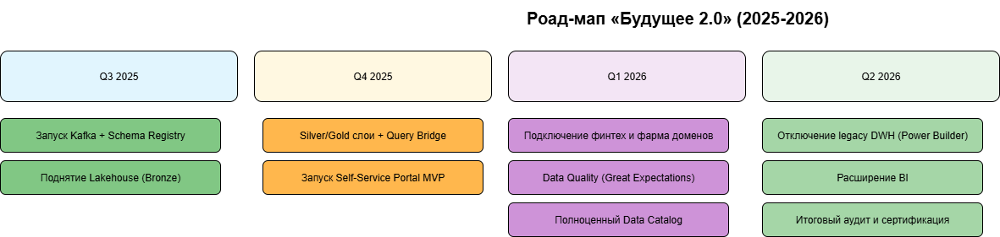

# Задание 3

## Технический радар

| Категория / Кольцо              | Технология / Методология   | Комментарий                                            |
|---------------------------------| -------------------------- |--------------------------------------------------------|
| ADOPT (используем прямо сейчас) | Kafka, Schema Registry     | Единый event-bus                                       |
|                                 | Delta Lake (Lakehouse)     | Замена MSSQL-2008, единое хранилище                    |
|                                 | Kubernetes                 | Единая облачная платформа для всех новых сервисов      |
|                                 | Keycloak + Kong            | Централизованный SSO и API-Gateway                     |
|                                 | GitLab CI/CD               | Автоматизация тестирования и развёртывания             |
| TRIAL (пилот в Q3)              | Feast (Feature Store)      | Нужен для быстрой подачи фичей в ИИ-модели             |
|                                 | dbt (Data Build Tool)      | Превращает «raw SQL» в ревью-контролируемые модели     |
|                                 | Great Expectations         | Автоматические тесты качества данных                   |
|                                 | OPA (Open Policy Agent)    | Подмена жёстких ACL-скриптов на политики-as-code       |
| ASSESS (оценим до конца года)   | DataHub / Amundsen         | Полноценный Data-Catalog (сейчас только MVP)           |
|                                 | Apache Iceberg             | Альтернатива Delta Lake, смотрим на производительность |
|                                 | Flink SQL                  | Потенциально вместо Spark Streaming                    |
|                                 | Soda Core                  | Ещё один вариант DQ-автоматизации                      |
| HOLD (откладываем)              | Power Builder              | Оставляем только до полной миграции на наше решение    |
|                                 | SQL Server 2008            | Оставляем только до полной миграции на наше решение    |

## Роадмап

Ссылка на [drawio](./roadmap.drawio) файл

Картинкой:

## Обоснование

| №  | Этап                              | Цель / ценность                              |
| -- |-----------------------------------|----------------------------------------------|
| 1  | Kafka + Schema Registry           | Единый event-bus для развязывания доменов    |
| 2  | Lakehouse Bronze                  | Хранилище без DWH-логики, сырой лендинг      |
| 3  | Kubernetes-кластер                | Единая облачная площадка для микросервисов   |
| 4  | Миграция клиник в Kafka           | Первый домен перестаёт трогать легаси DWH    |
| 5  | Silver/Gold + Query Bridge        | Готовые витрины без SQL в Portal             |
| 6  | Self-Service Portal MVP           | Бизнес сам строит отчёты                     |
| 7  | Подключение финтех и фарма        | Остальные домены тоже автономны              |
| 8  | Data Quality (Great Expectations) | Поверка данных на входе/выходе               |
| 9  | Data Catalog (DataHub)            | Единый поиск и линейка данных                |
| 10 | Отключение legacy DWH             | Убираем риск технологического долга          |
| 11 | Расширение BI                     | Executive / KPI-дашборды "из коробки"        |
| 12 | Итоговый аудит и сертификация     | Подтверждение compliance (152-ФЗ, ISO-27001) |
